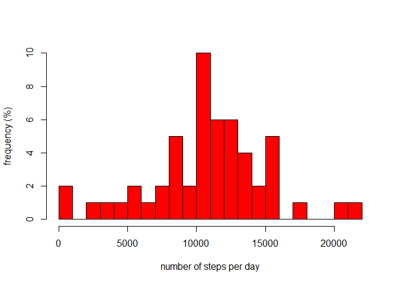
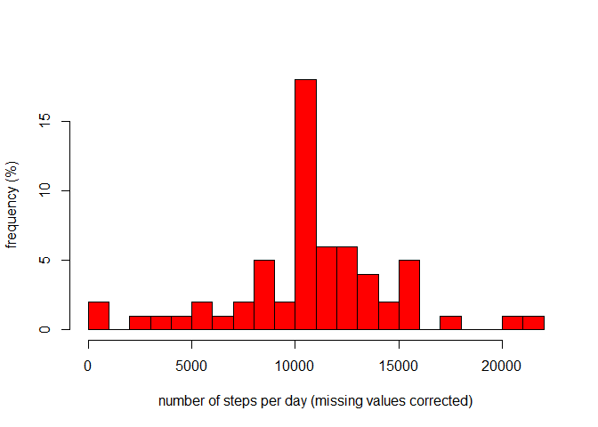
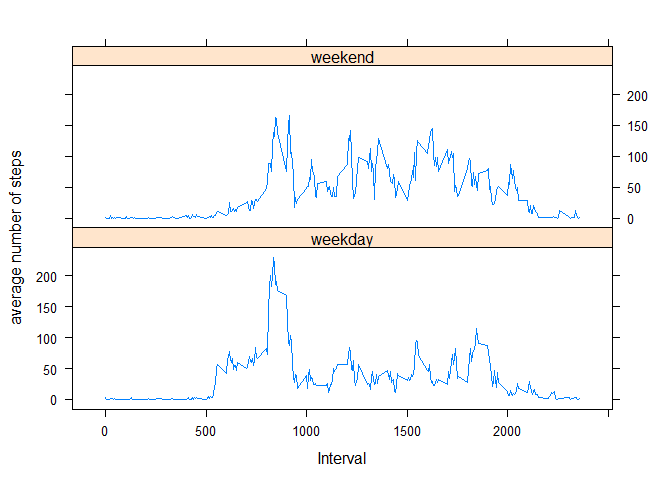

# PA1_template
Stefan Troost  
Sunday, August 17, 2014  


# Introduction
This assignment makes use of data from a personal activity monitoring device. This device collects data at 5 minute intervals through out the day. The data consists of two months of data from an anonymous individual collected during the months of October and November, 2012 and include the number of steps taken in 5 minute intervals each day.  
  
Dataset: Activity monitoring data [52K]  
  
The variables included in this dataset are:  
- steps: Number of steps taking in a 5-minute interval (missing values are coded as NA)  
- date: The date on which the measurement was taken in YYYY-MM-DD format  
- interval: Identifier for the 5-minute interval in which measurement was taken  
  
The dataset is stored in a comma-separated-value (CSV) file and there are a total of 17,568 observations in this dataset.

# Loading and preprocessing the data
The first step in this analysis is to load the data in the file "activity.csv" with:

```r
# load the data file
activityData<-read.csv("activity.csv")
```

# The mean total number of steps taken per day
In order to get an idea of the amount of steps taken each day, below is a histogram  (leaving out missing values):  

```r
NumberOfStepsPerDay<-aggregate(steps ~ date, data = activityData, FUN = sum, na.action = na.omit)
h<-hist(NumberOfStepsPerDay$steps, breaks=30, include.lowest=TRUE, plot=FALSE)
plot(h, col="red", main="", xlab="number of steps per day", ylab="frequency (%)")
```

 

```r
MeanTotalStepsPerDay<-as.integer(mean(NumberOfStepsPerDay$steps))
MedianTotalStepsPerDay<-as.integer(median(NumberOfStepsPerDay$steps))
```
  
There is not much difference between the mean number of total steps per day, **10766**, and the median number of total steps per day, **10765**

# What is the average daily activity pattern?
Below is a plot of the average daily pattern, meaning the amount of steps for each 5-minute time interval, averaged over all the days in the dataset :  

```r
AverageDailyPattern<-aggregate(steps ~ interval, data = activityData, FUN = mean, na.action = na.omit)
plot(AverageDailyPattern, type="l")
```

 

In order to get the interval with the highest average amount of steps, I define the following function:  

```r
GetIntervalMaxAverageDailyPattern<-function(data) {
  maxSteps<-max(data$steps)
  maxInterval<-data[data$steps==maxSteps,"interval"]
  return(maxInterval)
}
```

The interval with the highest average amount of steps is **835**

# Imputing missing values
### Counting the incomplete cases
This dataset contains 3 variables: steps, date and interval  
- The number of missing values of the variable steps is: **2304**  
- The number of missing values of the variable date is: **0**  
- The number of missing values of the variable interval is: **0**  
- The number of records with missing values in any of the three variables is: **2304**

### Filling in the missing values
I have chosen to fill in the missing values of the variable steps by taking the average of the particular interval of all days, and replacing the missing value by that number. First I merge the activity data set with the AverageDailyPattern set defined earlier:

```r
activityDataWithoutMissingValues<-merge(activityData,AverageDailyPattern,by.x="interval",by.y="interval")
```
The resulting dataframe contains the two steps variables steps.x and steps.y. Now I define the variable steps that takes the value of steps.x only if it is not an NA, otherwise it takes the value of steps.y: 

```r
activityDataWithoutMissingValues$steps=ifelse(is.na(activityDataWithoutMissingValues$steps.x),activityDataWithoutMissingValues$steps.y,activityDataWithoutMissingValues$steps.x)
activityDataWithoutMissingValues$steps.x<-NULL
activityDataWithoutMissingValues$steps.y<-NULL
```
    
Again, I make a histogram of the total number of steps taken each day and calculate the mean and median total number of steps taken per day: 
  

```r
NumberOfStepsPerDayWithoutMissingValues<-aggregate(steps ~ date, data = activityDataWithoutMissingValues, FUN = sum, na.action = na.omit)
h<-hist(NumberOfStepsPerDayWithoutMissingValues$steps, breaks=30, include.lowest=TRUE, plot=FALSE)
plot(h, col="red", main="", xlab="number of steps per day (missing values corrected)", ylab="frequency (%)")
```

 

```r
MeanTotalStepsPerDayWithoutMissingValues<-as.integer(mean(NumberOfStepsPerDayWithoutMissingValues$steps))
MedianTotalStepsPerDayWithoutMissingValues<-as.integer(median(NumberOfStepsPerDayWithoutMissingValues$steps))
```
  
The values in the histogram differ of course from those in the first histogram as it represents the sum of steps taken in all intervals. The days without any measurements now have a total number of steps summing the average values in all intervals, so more observations around the average total number of steps will occur. The mean number of total steps per day should not differ however. The new mean number of total steps per day has now become **10766** compared to **10766** before, and the median number of total steps per day has now become **10766** compared to **10765** before. The slight difference in the median number value is caused by taking average values. The difference is only slight as the difference between the mean and median number was small in the first place.

# Differences in activity patterns between weekdays and weekends
First I create the variable isWeekday taking the value of 1 in case of a midweek day and 0 otherwise:  

```r
activityDataWithoutMissingValues$dayType<-as.factor(ifelse(weekdays(as.Date(activityDataWithoutMissingValues$date)) %in% c("Saturday", "Sunday"),"weekend","weekday"))
```


```r
AverageDailyPatternWeekday<-aggregate(steps ~ interval + dayType, data = subset(activityDataWithoutMissingValues,dayType=="weekday"), FUN = mean, na.action = na.omit)
AverageDailyPatternWeekend<-aggregate(steps ~ interval + dayType, data = subset(activityDataWithoutMissingValues,dayType=="weekend"), FUN = mean, na.action = na.omit)
averagedActivityData<-rbind(AverageDailyPatternWeekday,AverageDailyPatternWeekend)
library(lattice)
xyplot(averagedActivityData$steps ~ averagedActivityData$interval | averagedActivityData$dayType,xlab="Interval",ylab="average number of steps",type="l",layout=c(1,2))
```

 


